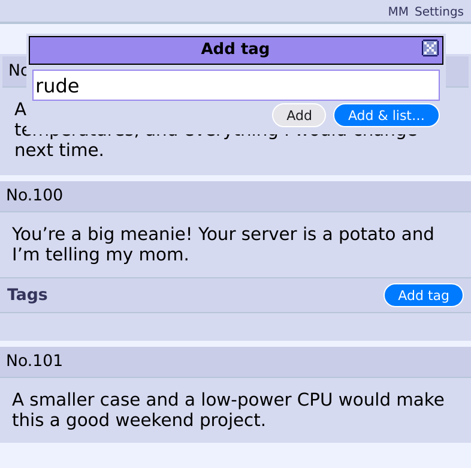
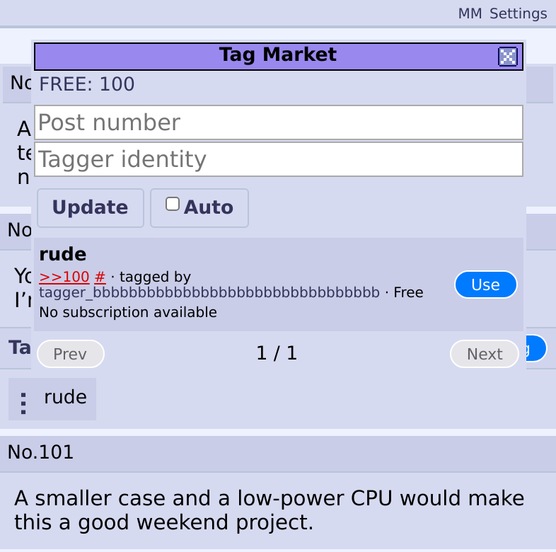
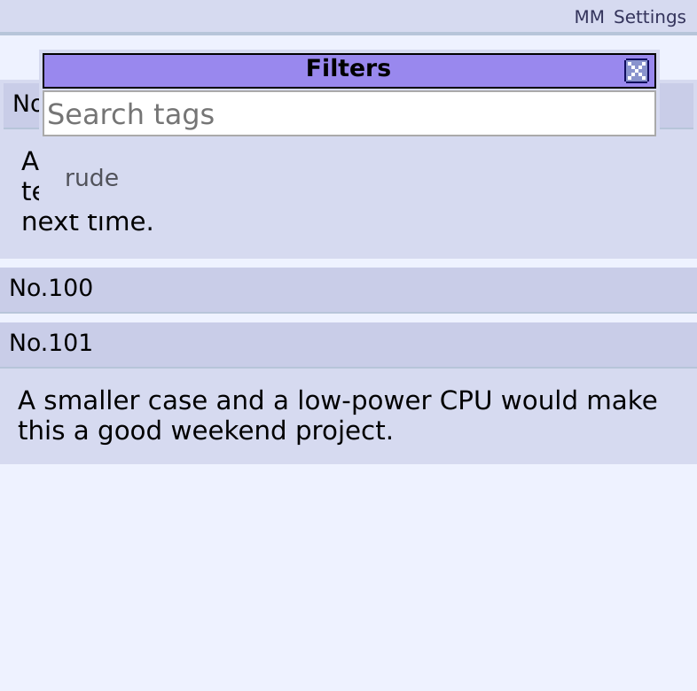

# Mercenary Moderators

Tag 4chan posts, discover tags from other readers, and choose which posts to hide.

[Website and download](https://mm.bradthomasbrown.com/) · [Installation and usage wiki](https://mm.bradthomasbrown.com/wiki)

[GitHub releases](https://github.com/bradthomasbrown/Mercenary-Moderators/releases) provide the versioned installer ZIP and its checksum. Choose the **mm-user-…zip** asset; GitHub's automatic **Source code** archives are not the installer.

This repository contains the source shipped in user extension **0.16.8**, licensed under [PolyForm Shield 1.0.0](LICENSE), with [third-party exceptions](THIRD-PARTY-NOTICES.md). Independent feature work and pull requests are welcome; see [Contributing](CONTRIBUTING.md).

## See how it works

1. Tag a rude reply.
2. Share or discover tags through the market.
3. Select a tag in Filters to hide matching replies.





These are captures of the actual extension with authored example posts and market data, taken in Chromium at phone width. They are not Orion/iPhone captures.

## Install

Orion on iPhone is the primary use and testing environment. This is an early beta. Compatible desktop browsers are experimental, and the current ZIP does not support Firefox.

1. Download the user ZIP from the website and save it in Files.
2. In Orion, open Extensions, choose **+**, then **Install from File**. Select the ZIP.
3. Enable the extension, allow it on `boards.4chan.org`, and open or reload a thread.

[Full installation instructions and troubleshooting](https://mm.bradthomasbrown.com/wiki#install)

Keep the extension's local data when updating. [Identity and backup guidance](https://mm.bradthomasbrown.com/wiki#backup) explains recovery and the limits of preservation across Orion ZIP installations.

## What is included

`extension/` contains the exact JavaScript, HTML, CSS and manifest from the user ZIP. It supports local tagging/filtering, market browsing and listing, FREE balances, subscriptions, error traces, and optional encrypted identity backups.

Local tags and filters can be used without the market. FREE is an experimental currency with no cash value. The market and backup features contact the MM service; this repository does not include that service's implementation.

The user package requests `storage` and `alarms`, access to the MM service host, and content-script access to 4chan thread pages. See [`extension/manifest.json`](extension/manifest.json) for the exact scope and [`docs/ARCHITECTURE.md`](docs/ARCHITECTURE.md) for the module map.

## Reproduce the shipped ZIP

Python 3 and its standard library are sufficient:

```sh
python3 scripts/build.py --verify
```

This packages the files with the original deterministic ZIP format, writes `dist/mm-user-0.16.8.zip`, and compares every file and the complete archive with `release.json`.

Expected SHA-256:

```text
ebaa0c669df91a529ffca12abc54ff8f6bb4a72e81ffde8c4121be08a2250649
```

A matching archive establishes the connection to the published download. It does not establish correctness or a security audit. The upstream project's behavior tests have not yet been extracted into this repository.

## Bugs and error traces

Describe what you tried, what happened, and your extension version and browser. The extension menu's **Error trace** can copy a bounded local diagnostic report. Review any report before sharing it, and never include a recovery code or account key.

## Development status

The initial implementation was written by agents. Maintenance work focuses on understandable modules, reproducible releases, tested behavior and clearly documented limitations. [`docs/MAINTENANCE.md`](docs/MAINTENANCE.md) records the current gaps and review priorities.

This repository is a snapshot of the shipped user extension. It does not contain the entire development workspace or its history. A repository update does not automatically deploy a new extension version.

## License and attribution

[PolyForm Shield 1.0.0](LICENSE) permits work on the code for permitted purposes and restricts providing competing products, including free substitutes. This is source-available software. See [NOTICE](NOTICE) for scope and required notices and [THIRD-PARTY-NOTICES.md](THIRD-PARTY-NOTICES.md) for exceptions, including the LGPL button stylesheet.

You can develop features and submit pull requests without prior permission or a separate contributor agreement. Contributions use the applicable project license; maintainers decide which changes to merge. [Contribution details](CONTRIBUTING.md) · [License decision](docs/LICENSE-OPTIONS.md) · [Attribution](docs/ATTRIBUTION.md)

Mercenary Moderators is independent and is not affiliated with 4chan.
